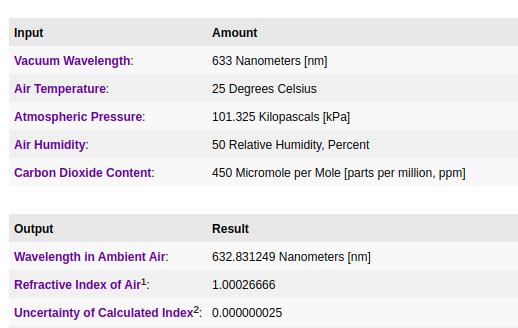

<style>
  .my-heading {
    font-size: 24px; 
    font-weight: bold;
    text-align: center;
  }

  .sumario {
    font-size: 26px;
  }

</style>

<script type="text/javascript" src="http://cdn.mathjax.org/mathjax/latest/MathJax.js?config=TeX-AMS-MML_HTMLorMML"></script>
<script type="text/x-mathjax-config">
  MathJax.Hub.Config({ tex2jax: {inlineMath: [['$', '$']]}, messageStyle: "none" });
</script>

<center><p style="font-size:64px;"><b>UERJ</b></p></center>
<center><p style="font-size:24px;"><b>UNIVERSIDADE DO ESTADO DO RIO DE JANEIRO</b></p></center>
<center><p style="font-size:24px;"><b>INSTITUTO DE FÍSICA ARMANDO DIAS TAVARES</b></p></center>
<center></center>


Alunos:

Matheus Ramos de Souza
<br>
Raphael Marcelo Costa de Lima

<center><b style="font-size:24px;">Interferometria de Precisão</b></center>


<br><br><br><br><br><br><br>

<center style="font-size:16px;"> Rio de Janeiro - 2024</center>

<div style="page-break-after: always;"></div>

<p class="my-heading" id="sumario"> Sumário </p>

<a class="sumario" href="#introducao"> 1. Introdução</a>

<a class="sumario" href="#objetivos"> 2. Objetivos </a>

<a class="sumario" href="#materiais_e_metodos"> 3. Materiais e Métodos </a>

<a class="sumario" href="#analy"> 4. Análise de Dados </a>

<a class="sumario" href="#erros_e_comp"> 5. Erros e Compatibilidade </a>


<div style="page-break-after: always;"></div>

<p class="my-heading" id="introducao"> Introdução </p> 

Neste experimento, utilizaremos um interferômetro de Michelson modificado para investigar a relação entre o índice de refração do ar e sua pressão, demonstrando como a variação de pressão em uma célula de vácuo influencia o padrão de interferência.

A técnica consiste em dividir um feixe de luz em dois caminhos diferentes, refletindo-o de volta e recombinando-o para formar padrões de interferência. Qualquer mudança nos comprimentos de trajeto ou nas propriedades do meio por onde a luz se propaga resulta em deslocamentos nas franjas de interferência, permitindo o estudo detalhado dessas variações.

Pela quinta equação apresentada no relatório:

$\LARGE
\frac{n_f - n_i}{P_f - P_i} = \frac{N \cdot \lambda_0}{2 \cdot d \cdot (P_f - P_i)}
$

temos a relação entre a variação do índice de refração e a variação da pressão, onde $n_f$ e $n_i$ são os índices de refração final e inicial, respectivamente, $P_f$ e $P_i$ são as pressões final e inicial, respectivamente, $N$ é o número de franjas observadas, $\lambda_0$ é o comprimento de onda da luz utilizada e $d$ é a distância entre os espelhos do interferômetro.

$\LARGE
n_f - n_i = \frac{N \cdot \lambda_0}{2 \cdot d}
$ (1)

sabemos que existe a seguinte relação entre o índice de refração e a pressão:

$\LARGE
n = n_0 + \alpha \cdot P
$

e podemos encontrar a variação do índice de refração em função da pressão:

$\LARGE
n_f - n_i = \alpha \cdot (P_f - P_i)
$ (2)

assim, podemos substituir a equação (2) na (1):

<div id="eq_3"></div>

$\LARGE
\alpha \cdot (P_f - P_i) = \frac{N \cdot \lambda_0}{2 \cdot d}
$ (3)

achando o valor de $\alpha$, podemos substituir novamente na equação (2) e encontrar o valor de $n_f$.

[Voltar ao sumário](#sumario)
<div style="page-break-after: always;"></div>

<p class="my-heading" id="objetivos"> Objetivos </p> 

a partir dos dados coletados:

<div id="tabela_intr"></div>

```
+---+-----------+-----------+----+
|   | Pi (mmhg) | Pf (mmhg) | N  |
+---+-----------+-----------+----+
| 0 |    80     |    440    | 10 |
| 1 |    120    |    400    | 8  |
| 2 |    90     |    300    | 6  |
| 3 |    150    |    290    | 4  |
| 4 |    140    |    220    | 2  |
+---+-----------+-----------+----+
```

onde:

A pressão inicial $ P_i $ e $ P_f $ estão em mmhg e N é a quantidade de faixas de interferência que passaram em relação a essas pressões

e a partir da <a href="#eq_3">equação 3</a> podemos construir uma relação linear de mínimos quadrados entre a diferença de pressão $ P_f $ e $ P_i $ e $\frac{N \cdot \lambda_0}{2 \cdot d} $

onde nosso x = $ Pi - Pf $ e y = $\frac{N \cdot \lambda_0}{2 \cdot d} $

e podemos depois substituir esse valor em:

$ n_f - n_i = \alpha \cdot (P_f - P_i) $

podemos considerar $ n_i $ como 1 (índice de refração no vácuo) e $ n_f $ será o índice de refração do ar, dado que colocamos ar para aumentar a pressão na nossa válvula e modificar as faixas N.

[Voltar ao sumário](#sumario)
<div style="page-break-after: always;"></div>

<p class="my-heading" id="materiais_e_metodos"> Materiais e Métodos </p>

Os materiais utilizados foram:

- Base para o interferômetro
- fonte de lazer
- espelhos da base, móvel e fixo
- lente de f = 18mm
- divisor de feixe
- papel com suporte para visualização das franjas
- bomba manual de vácuo

Fizemos o processo de montagem disponível do relatório, e com a bomba de vácuo, aumentamos a pressão na célula de vácuo, e observamos as franjas de interferência, anotando a quantidade de franjas que passaram em relação a pressão inicial e final.

Fizemos esse processo para 5 pressões diferentes, e anotamos os valores de $ P_i $, $ P_f $ e N.

[Voltar ao sumário](#sumario)
<div style="page-break-after: always;"></div>

<p class="my-heading" id="analy"> Análise de Dados </p> 

dada a <a href="#tabela_intr">tabela apresentada nos objetivos</a>

podemos construir o primeiro gráfico:

<figure id="graf_1">
</img>
<figcaption> Visualização dos dados coletados Fonte: Autores </figcaption>
</figure>


agora, podemos calcular o valor de y proposto nos objetivos, que é a equação:

$\LARGE
\frac{N \cdot \lambda_0}{2 \cdot d}
$

com os valores de N = 10, 8, 6, 4, 2, $\lambda_0 = 632.8 nm$ e $d = 3 \times 10^{-2} m$

teremos a seguinte tabela:

```
+---+-----------+-----------+------+-----------+--------+
|   | Pi (mmhg) | Pf (mmhg) |  N   | ΔP (mmhg) | y*10^5 |
+---+-----------+-----------+------+-----------+--------+
| 0 |   80.0    |   440.0   | 10.0 |   360.0   | 10.55  |
| 1 |   120.0   |   400.0   | 8.0  |   280.0   |  8.44  |
| 2 |   90.0    |   300.0   | 6.0  |   210.0   |  6.33  |
| 3 |   150.0   |   290.0   | 4.0  |   140.0   |  4.22  |
| 4 |   140.0   |   220.0   | 2.0  |   80.0    |  2.11  |
+---+-----------+-----------+------+-----------+--------+
```

e agora podemos fazer, pelo método de mínimos quadrados, achar a equação da reta que melhor se ajusta a esses pontos (y, e ΔP), e a partir dela, achar o valor de $\alpha$ e, consequentemente, o valor de $n_f$.

fazendo o método de mínimos quadrados, encontramos o valor de $\alpha$ como $ 2.96 \times 10^{-7} $, e substituindo na equação $ n_f - n_i = \alpha \cdot (P_f - P_i) $, encontramos o valor de $ n_f $ como 1.000225

E os valores encontrados para $ n_f $:

```
+---+----------+
|   | n_final  |
+---+----------+
| 0 | 1.000107 |
| 1 | 1.000083 |
| 2 | 1.000062 |
| 3 | 1.000042 |
| 4 | 1.000024 |
+---+----------+
```

e a imagem do gráfico final com a reta ajustada:


<figure id="graf_2">
</img>
<figcaption> Visualização dos dados coletados Fonte: Autores </figcaption>
</figure>

[Voltar ao sumário](#sumario)
<div style="page-break-after: always;"></div>

<p class="my-heading" id="erros_e_comp"> Erros e compatibilidade </p> 


Temos o valor de referência do site: https://emtoolbox.nist.gov/Wavelength/Ciddor.asp

na imagem abaixo:

<figure id="valor_referencia">
</img>
<figcaption>Valor de referência </figcaption>
</figure>

o erro da medida da pressão é de 5 mmhg, tanto para a pressão inicial quanto para a pressão final.

Então, podemos propagar o erro da seguinte forma:

$\LARGE
a = y/x
$

e podemos propagar pela divisão:

$\LARGE
\sigma_a = a \cdot \sqrt{\left(\frac{\sigma_x}{x}\right)^2 + \left(\frac{\sigma_y}{y}\right)^2}
$

o erro de y é zero, então:

$\LARGE
\sigma_a = a \sqrt{\left(\frac{\sigma_x}{x}\right)^2}
$

E assim vamos encontrar o "a_err" na tabela abaixo:

```
+---+-------+-------+------+---------+----------+-------------+
|   |  Pi   |  Pf   |  N   | delta_P | n_final  | a_err * 1e9 |
+---+-------+-------+------+---------+----------+-------------+
| 0 | 80.0  | 440.0 | 10.0 |  360.0  | 1.000107 |    4.12     |
| 1 | 120.0 | 400.0 | 8.0  |  280.0  | 1.000083 |     5.3     |
| 2 | 90.0  | 300.0 | 6.0  |  210.0  | 1.000062 |    7.06     |
| 3 | 150.0 | 290.0 | 4.0  |  140.0  | 1.000042 |    10.59    |
| 4 | 140.0 | 220.0 | 2.0  |  80.0   | 1.000024 |    18.54    |
+---+-------+-------+------+---------+----------+-------------+
```

que sua média é:

a_err_media = 9.12e-09

agora, precisamos encontrar o erro de $ n_f $

$ nf = \alpha * (P_f - P_i) + ni$

então precisamos propagar mais uma vez da mesma forma apresentado anteriormente, fazendo propagação de erros.

encontramos que o erro é:

```
+---+------+---------+----------+-------------+--------------------+
|   |  N   | delta_P | n_final  | a_err * 1e9 | n_final_erro * 1e3 |
+---+------+---------+----------+-------------+--------------------+
| 0 | 10.0 |  360.0  | 1.000107 |    4.12     |       19.64        |
| 1 | 8.0  |  280.0  | 1.000083 |     5.3     |       25.26        |
| 2 | 6.0  |  210.0  | 1.000062 |    7.06     |       33.67        |
| 3 | 4.0  |  140.0  | 1.000042 |    10.59    |       50.51        |
| 4 | 2.0  |  80.0   | 1.000024 |    18.54    |       88.39        |
+---+------+---------+----------+-------------+--------------------+
```


o valor de referência é 1.000266, então, assim, podemos fazer a compatibilidade:

média(n_final) e média(n_final_erro) são os vetores da tabela acima.

|média(n_final) - valor_referencia| / média(n_final_erro)

substituindo valores, temos:

$ |1.00006346-1.000266|/0.04349 < 2 $

$ 0.0046 < 2 $

logo, o valor é compatível

ainda podemos fazer o erro relativo:

|1.00006346-1.000266|/1.000266 * 100 = 0.02%

então chegamos em um valor bem próximo do esperado.

[Voltar ao sumário](#sumario)
<div style="page-break-after: always;"></div>

<p class="my-heading" id="introducao"> Conclusão </p> 

O experimento permitiu concluir com sucesso a relação entre pressão e o índice de refração do ar.

Só conseguimos determinar a compatibilidade dada a propagação de erros, podemos, por exemplo, observar como o erro foi diminuindo conforme utilizamos maior quantidade de franjas:


```
+---+------+---------+--------------+
|   |  N   | delta_P | n_final_erro |
+---+------+---------+--------------+
| 0 | 10.0 |  360.0  |    0.0196    |
| 1 | 8.0  |  280.0  |    0.0253    |
| 2 | 6.0  |  210.0  |    0.0337    |
| 3 | 4.0  |  140.0  |    0.0505    |
| 4 | 2.0  |  80.0   |    0.0884    |
+---+------+---------+--------------+
```

e não só isso, podemos ver que o $n_f$ foi se aproximando do valor esperado conforme aumentamos a quantidade de franjas:

```
+---+------+---------+----------+
|   |  N   | delta_P | n_final  |
+---+------+---------+----------+
| 0 | 10.0 |  360.0  | 1.000107 |
| 1 | 8.0  |  280.0  | 1.000083 |
| 2 | 6.0  |  210.0  | 1.000062 |
| 3 | 4.0  |  140.0  | 1.000042 |
| 4 | 2.0  |  80.0   | 1.000024 |
+---+------+---------+----------+
```

Então, se o experimento fosse refeito com mais franjas, poderíamos ter erros menores e um valor de $n_f$ mais próximo do esperado, pode não refletir na compatibilidade, pois teríamos um erro menor, então precisaríamos de mais precisão, porém é uma observação que podemos fazer a partir dos erros.

[Voltar ao sumário](#sumario)
