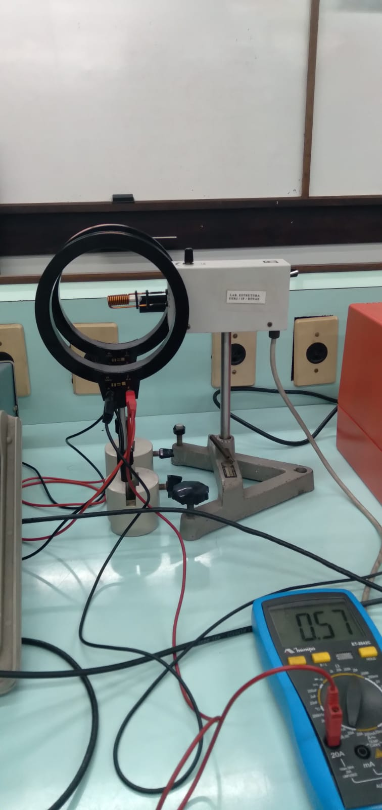
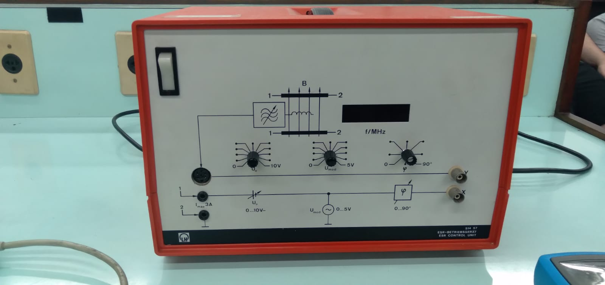
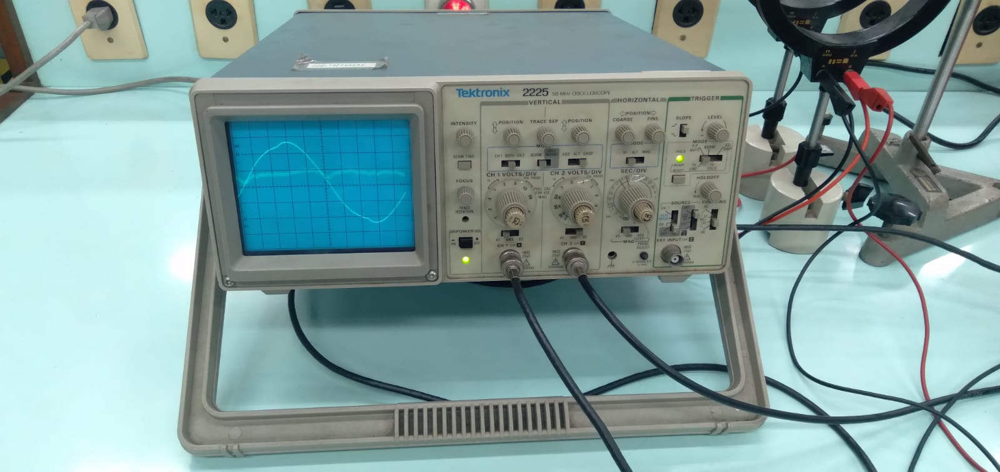

<style>
  .my-heading {
    font-size: 24px; 
    font-weight: bold;
    text-align: center;
  }

  .sumario {
    font-size: 26px;
  }

</style>

<script type="text/javascript" src="http://cdn.mathjax.org/mathjax/latest/MathJax.js?config=TeX-AMS-MML_HTMLorMML"></script>
<script type="text/x-mathjax-config">
  MathJax.Hub.Config({ tex2jax: {inlineMath: [['$', '$']]}, messageStyle: "none" });
</script>

<center><p style="font-size:64px;"><b>UERJ</b></p></center>
<center><p style="font-size:24px;"><b>UNIVERSIDADE DO ESTADO DO RIO DE JANEIRO</b></p></center>
<center><p style="font-size:24px;"><b>INSTITUTO DE FÍSICA ARMANDO DIAS TAVARES</b></p></center>
<center></center>


Alunos:

Matheus Ramos de Souza
<br>
Raphael Marcelo Costa de Lima

<center><b style="font-size:24px;">Ressonância do Spin do Elétron</b></center>


<br><br><br><br><br><br><br>

<center style="font-size:16px;"> Rio de Janeiro - 2024</center>

<div style="page-break-after: always;"></div>

<p class="my-heading" id="sumario"> Sumário </p>

<a class="sumario" href="#introducao"> 1. Introdução</a>

<a href="#o-momento-magnético-e-momento-angular-do-spin">1.1 O momento magnético e momento angular do spin</a>
<br>
<a href="#efeito-do-campo-magnético-no-momento-ângular">1.2 Efeito do campo magnético no momento ângular</a>

<br>

<a class="sumario" href="#objetivos"> 2. Objetivos </a>

<a href="#fator-de-landé">2.1 Fator de Landé</a>
<br>
<a href="#dados-necessários">2.2 Dados Necessários</a>

<br>

<a class="sumario" href="#pros_exp"> 3 Procedimento Experimental </a>

<a href="#materiais-utilizados">3.1 Materiais utilizados</a>
<br>
Referencia de materiais:
<br>
<a href="#fig_M1">M1 Materiais utilizados</a>
<br>
<a href="#fig_M2">M2 Materiais utilizados</a>
<br>
<a href="#fig_M3">M3 Materiais utilizados</a>
<br>
<a href="#fig_M4">M4 Materiais utilizados</a>
<br>

<a href="#fig_1"> 3.1.1 Figura 1 - Formato do experimento</a>
<br>
<a href="#tabela"> 3.1.2 Tabela de dados</a>


<a class="sumario" href="#dados"> 4. Análise de dados </a>

<a href="#fig_2"> 4.1 Visualização dos dados coletados</a>
<br>
<a href="#encontrando-gs-do-experimento"> 4.2 Encontrando o Fator de Landé do experimento </a>
<br>
<a href="#incerteza-do-coeficiente-angular-utilizando-monte-carlo"> 4.2 Incerteza do coeficiente angular com monte carlo </a>

<br>

<a class="sumario" href="#conclusao"> Conclusao </a>

<div style="page-break-after: always;"></div>

<p class="my-heading" id="introducao"> Introdução </p> 

## O momento magnético e momento angular do spin


$\large \vec{\mu_s} = - g_s \mu_B \frac{\vec{s}}{\hbar}$ (1) 

- $\large g_s$ é o fator de Landé
- $\large \mu_g$ é o magneton de bohr (uma constante $\mu_B = \frac {e\hbar}{2m_e}$)

- $\large \vec{s}$ é o momento angular do spin

temos também que, pela quantização do momento angular do spin:

$\vec{S_z} = m_s \hbar$

$m_s = \frac {\vec{S_z}}{\hbar}$ (2)


onde o número quântico magnético $m_s$ só pode assumir os valores $ \pm \frac {1}{2} $

substituindo (2) em (1):

$\large \vec{\mu_s} = g_s \mu_B m_s$

sabendo que quando um campo magnético externo é aplicado, a energia associada com o momento é:

$E = - \vec{\mu_s} . \vec{B}$

devido a quantização do spin, sabemos que só podemos ter 2 estados de energia:

1. o menor estado de energia $m_s = +\frac{1}{2}$

$\large E_{min} = - \frac{g_s \mu_b B}{2}$

2. o maior estado de energia $m_s = -\frac{1}{2}$

$\large E_{max} = \frac{g_s \mu_b B}{2}$

logo, quando o eletron for do menor estado de energia para o maior estado de energia

$\Delta E = g_s \mu_b B$

quando ocorre a transição entre 2 níveis de energia, sabemos que o sistema deve obrigatoriamente absorver ou emitir um fóton, então:

$hv = g_s \mu_b B$

onde podemos isolar o v para chegar na fórmula presente no roteiro do experimento:

$\LARGE v = \frac{g_s \mu_b B}{h}$

## Efeito do campo magnético no momento ângular

O campo magnético não afeta na magnetude do spin do momento angular (já que ele não faz parte da fórmula...), mas ele influencia a orientação de $\vec{s}$ em relação a direção do campo - o que queremos afimar com isso:

$E = - \vec{\mu} . \vec{B}$

abrindo o produto escalar:

$E = - |\mu| . |B| cos\theta$

na ausencia de B, é impossível determinar a direção $\theta$, agora com B...

1. $m_s = - \frac{1}{2}$
o ângulo $\theta$ será 0

2. por consequência $m_s = + \frac{1}{2}$
o ângulo $\theta$ será 180

então sabemos que só poderemos ter esses 2 estados do elétron quando está sob efeito de um campo magnético.

[Voltar ao sumário](#sumario)
<div style="page-break-after: always;"></div>

<p class="my-heading" id="objetivos"> Objetivos </p>

## Fator de Landé

Dada a introdução, sabemos que quando há um campo magnético, podemos observar a seguinte fórmula:

$\LARGE v = \frac{g_s \mu_b \vec{B}}{h}$

h é a constante de planck = $6.626 \times 10^{-34} J.s$

$\mu_b$ é o magneton de Bohr $ = 9.274 \times 10^{-24}$


então, temos como objetivo calcular $g_s$, a partir de dados coletados, desta maneira teremos como observar os 2 estados mostrados na introdução sobre o spin do elétron.

o fator de Landé $g_s$ = 2 é o fator para o elétron.

## Dados necessários

com isso em mente montados um experimento que conseguimos ter a frequência e a corrente que foi passada nas bobinas. Assim podemos calcular o campo magnético, que é dado por:

$\large B = \frac{8 \mu_0 N I}{\sqrt{125} R} $

onde temos:

R = $6.8 \times 10^{-2}$ m
<br>
N = 320, número de espiras na bubina, adimensional.
<br>
I = corrente, será coletada pelo multimetro
<br>
$\mu_0$ é uma constante conhecida, permissividade do vácuo, dada por: $1.256 \times 10^{-6} N/A$
<br>

assim, podemos tentar encontrar $g_s$

[Voltar ao sumário](#sumario)
<div style="page-break-after: always;"></div>

<p class="my-heading", id="pros_exp"> Procedimento Experimental <p>


## Materiais utilizados

Lista dos materiais utilizados:

- 1 multímetro MINPA ET2042C
- 4 cabos (para ligar os componentes)
- gerador de rádio-frequência
- osciloscópio
- 2 bobinas de Helmholtz


<center> <figure id="fig_M1" style="height: 25%; width: 30%;">

<figcaption><b>Figura M1 </b> Base com as bobinas </figcaption>
</figure> </center>


<center> <figure id="fig_M2" style="height: 25%; width: 50%;">

<figcaption><b>Figura M2</b> Multimetro </figcaption>
</figure> </center>


<center> <figure id="fig_M3" style="height: 25%; width: 50%;">

<figcaption><b>Figura M3:</b> Base de Radio frequência </figcaption>
</figure> </center>

conectamos os 4 cabos com o multímetro (que será utilizado para medir a corrente entre a unidade de controle e as bobinas) e o gerador de radio-frequência.

precisamos que as bobinas fiquem paralelas, com a sonda de amostra aproximadamente na região central entre as duas, e que a distância entre as 2 bobinas deve ser aproximadamente o seu raio.

Conectando a base de radio frequência, com a unidade de sonda e com o osciloscópio, podemos observar no osciloscópio:

<center> <figure id="fig_M4" style="height: 25%; width: 50%;">

<figcaption><b>Figura M4:</b> Osciloscópio </figcaption>
</figure> </center>

seguindo o passo a passo ofereceido pelo roteiro, montamos o experimento e fizemos as 10 medidas:


<div id="tabela"></div>

```
╔═════════╦═══════╦═════════════╦════════════╗
║   I (A) ║   MHz ║   I_err (A) ║      B (T) ║
╠═════════╬═══════╬═════════════╬════════════╣
║    0.58 ║    30 ║      0.0616 ║ 0.00245298 ║
╠═════════╬═══════╬═════════════╬════════════╣
║    0.63 ║    33 ║      0.0626 ║ 0.00266444 ║
╠═════════╬═══════╬═════════════╬════════════╣
║    0.71 ║    36 ║      0.0642 ║ 0.00300278 ║
╠═════════╬═══════╬═════════════╬════════════╣
║    0.79 ║    39 ║      0.0658 ║ 0.00334113 ║
╠═════════╬═══════╬═════════════╬════════════╣
║    0.88 ║    42 ║      0.0676 ║ 0.00372176 ║
╠═════════╬═══════╬═════════════╬════════════╣
║    0.92 ║    45 ║      0.0684 ║ 0.00389093 ║
╠═════════╬═══════╬═════════════╬════════════╣
║    1    ║    48 ║      0.07   ║ 0.00422927 ║
╠═════════╬═══════╬═════════════╬════════════╣
║    1.06 ║    51 ║      0.0712 ║ 0.00448303 ║
╠═════════╬═══════╬═════════════╬════════════╣
║    1.11 ║    54 ║      0.0722 ║ 0.00469449 ║
╠═════════╬═══════╬═════════════╬════════════╣
║    1.17 ║    57 ║      0.0734 ║ 0.00494825 ║
╠═════════╬═══════╬═════════════╬════════════╣
║    1.25 ║    60 ║      0.075  ║ 0.00528659 ║
╚═════════╩═══════╩═════════════╩════════════╝
```
com as suas respectivas unidades. Não foi pego o erro possível da frequencia, porém temos o erro do multímetro: 2% + 5D.

B foi calculado a partir da fórmula disponível na parte de <a href="#dados-necessários"><b>objetivos</b></a>


[Voltar ao sumário](#sumario)
<div style="page-break-after: always;"></div>

<p class="my-heading" id="dados" > Análise de dados <p>

Gráfico representando os dados que coletamos

<figure id="fig_2">
</img>
<figcaption><b>Figura 2:</b> Visualização dos dados coletados Fonte: Autores </figcaption>
</figure>


Podemos fazer o método de mínimos quadrados entre <a href="#tabela"> B e MHz </a> de tal maneira que:

$\LARGE v = \frac{g_s \mu_b \vec{B}}{h}$

será:

$\LARGE y = \frac{g_s \mu_b}{h} x$

e na nossa regressão linear será:

$\LARGE y = a x$

onde:

$\LARGE a = \frac{g_s \mu_b}{h}$

note que vamos fazer o mínimos quadrados com Hz e não MHz.
<figure id="fig_3">
</img>
<figcaption><b>Figura 3:</b> Gráfico com mínimos quadrados. fonte: Autores. </figcaption>
</figure>

## Encontrando Gs do experimento

com o nosso valor de a (coeficiente angular), podemos encontrar $g_s$ experimental:

a = 11535318040

sabemos que multiplicarmos esse valor pela constante de planck e dividir por $ \mu_0 $, teremos:

$g_s = 0.824$ (approx)

## Incerteza do coeficiente angular utilizando monte carlo

para calcular o erro que essa regressão contém, podemos fazer simulação de monte-carlo para estimar incertezas:

o código abaixo pode ser encontrado [neste link](https://github.com/ms-cmy/relatorios-2024-est2/blob/master/relatorio_4/experimento.ipynb)


```python
a_values = []
for _ in range(1000):
    x_synthetic = df['I'].values + np.random.normal(0, df['I_err'])
    x_synthetic = u0 * N * x_synthetic * (4/5) ** (3/2)/R
    
    X = x_synthetic.reshape(-1, 1)
    Y = df['MHz'].values.reshape(-1, 1) * 1e6
    
    model = LinearRegression(fit_intercept=False)
    model.fit(X, Y)
    
    a_values.append(model.coef_[0][0])

a_mean = np.mean(a_values)
a_std = np.std(a_values)
```

na simulação, encontramos que:

$g_s = 0.824 +- 0.017$

sabendo que o valor teórico é 2, o nosso dado está bem fora do esperado.

## compatibilidade

Então vamos calcular a compatibilidade:

$|0.824 - 2| / 0.017 < 2 * $ erro menor que 2 desvios padrões

$70 < 2$

o que é bem distante de 2.

[Voltar ao sumário](#sumario)
<div style="page-break-after: always;"></div>

<p class="my-heading" id="conclusao"> Conclusão <p>

o valor que encontramos é incompatível com o valor esperado.
Podemos levantar alguns pontos para isso, como a dificuldade para ficar reajustando o experimento conforme o aumento da frequência, por conta da instabilidade do sinal.

Interferências externas podem ter atrapalhado também no campo magnético.

[Voltar ao sumário](#sumario)
